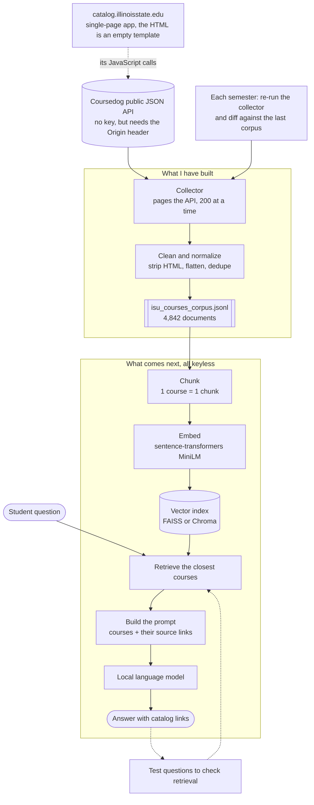

# isu-catalog-assistant
# ISU Course Catalog — Data Collection

I'm building an AI assistant that ISU students can ask questions about classes. Things
like what a course covers, what you need to take before it, or which classes count for a
general education category. For the assistant to answer with real information instead of
guessing, it needs the actual course catalog in a form it can search.

This repository is that part: getting the catalog data, cleaning it, and turning it into
a corpus the assistant can search. Everything here runs with no API key and no login.

---

## Running it

```bash
pip install -r requirements.txt

# Rebuild the committed sample. No network needed.
python src/collect_catalog.py --offline data/sample_api_records.json \
                              --stem sample_it_courses --no-raw

# Collect the whole live catalog. Takes about 25 seconds.
python src/collect_catalog.py

# Just one subject
python src/collect_catalog.py --subject IT
```

Or open `notebooks/244-SITCourseCatalog-Collector.ipynb` in Colab and click Runtime, then
Run all. There's nothing to install and no key to set up.

## Where the data is

My first attempt was a web crawler that started at catalog.illinoisstate.edu and followed
links. It ran fine and printed a long list of URLs, but when I looked at what it saved,
there were no course descriptions in it at all.

The reason is that the ISU catalog is a single-page app built with Coursedog. When my
crawler downloaded the HTML, all it got was an empty page template. The course list gets
filled in by JavaScript after the page loads in a real browser, and my crawler never ran
that JavaScript. So it kept collecting navigation links and jump links like
`#main-content` and treating them as new pages.

Instead of trying to make the crawler render JavaScript, I opened the browser's network
tab and watched what the catalog page requests while it loads. The page gets its data
from a public JSON API at `app.coursedog.com`:

- `GET /api/v1/ca/{school}/catalogs` lists the catalogs ISU has published
- `POST /api/v1/cm/{school}/courses/search/$filters` returns the courses

`{school}` is ISU's Coursedog tenant, `illinoisstate_peoplesoft_direct`. Behind Coursedog
is ISU's PeopleSoft system, and the course records still carry their PeopleSoft ids, so
this is the registrar's data rather than a copy of it. It comes back already organized
into fields: course code, title, description, credit hours, college, department, and
course attributes, which is much cleaner than anything I would have gotten by parsing
HTML.

## Getting access without a key

The API doesn't need a key, a login, or a token, but I did hit one problem. Called from
Google Colab it returned `401 Unauthorized` every time, which made me think it was locked
down.

It turned out Coursedog runs one API for a lot of different universities, and it only
answers when the request says which school's catalog site it belongs to. Once I added
`Origin` and `Referer` headers pointing at `catalog.illinoisstate.edu`, the exact same
request returned `200 OK` with the data. I tried it three ways to be sure: no headers
failed, a User-Agent alone failed, and Origin plus Referer worked. That was the only
thing standing between me and the data.

## What I collected

- 4,842 active courses from the 2026-2027 catalog
- 62 subject codes (the biggest are Music with 349 courses, English with 230, and Theatre
  with 213)
- 112 courses from the School of Information Technology
- 14 fields kept per course, out of about 40 the API returns
- 25 requests total, roughly 25 seconds to collect the whole thing

Unfiltered, the API returns 13,188 records, because it includes inactive courses and older
versions of courses. I filter those out with the same filter the catalog website uses,
which is how I get to 4,842. I checked that number against the course count the website
displays and it matches, so I know I have the whole catalog and not just the first few
pages.

My code also looks up which catalog is currently live instead of hard-coding it, so when
ISU publishes the 2027-2028 catalog it will switch over on its own.

## Cleaning I did

1. Filtered out inactive courses, which is what takes 13,188 records down to 4,842.
2. Used the right title. The API has two title fields, and the short one is a PeopleSoft
   abbreviation like `"Inter Digital World"`. The full title is in `longName`:
   `"Interacting In A Digital World"`. If I had used the abbreviation my searches would
   have been worse and I probably wouldn't have noticed why.
3. Stripped HTML tags and entities like `&nbsp;` out of the descriptions and cleaned up
   leftover spaces. None of the descriptions in this catalog actually had HTML in them,
   but older catalogs might, so I left the step in.
4. Flattened credit hours. They arrive nested with a minimum and a maximum, and I turned
   that into `"3"`, or `"1-6"` for courses you can repeat.
5. Split college codes off the names, so `"APSCI - Applied Science and Technology"`
   becomes a code plus a readable name.
6. Pulled department names out of nested objects.
7. Removed duplicate records and checked that every document ID is unique. That check
   caught two course codes, SOC 317 and TCH 394, that are used by two different course
   records. Without it, one would have silently overwritten the other.
8. Four courses have no description at all, so they get a placeholder instead of an empty
   entry going into the search index.
9. Added the catalog URL for each course so the assistant can link back to the official
   page.

Each course ends up as one document with its title, its details, and its description.
Here is what one looks like (there are 12 more in `data/sample_it_courses.jsonl`):

```
IT244 - Business Analytics for Artificial Intelligence
Course code: IT244
Subject: IT
Credit hours: 3
Level: Undergraduate
College: Applied Science and Technology
Department: School of Information Technology
Catalog: 2026-2027 Catalog
Source: https://catalog.illinoisstate.edu/courses/0055311

This course enables students to learn about Business Intelligence and explore the use of
business analytics models for artificial intelligence (AI) as the enabling technology from
a multi-disciplinary perspective. Prerequisites: IT 215 and IT 168
```

The whole set is saved as JSONL, one JSON object per line, which is the format the search
step expects. The script also writes a readable `.txt` version and the untouched API
records so I can go back and check anything.

## My workflow



I picked tools that don't need an API key, so the whole thing runs for free and I don't
have to worry about a budget or account limits. MiniLM embeddings and a local index both
run fine in Colab.

## What it can't do yet

Prerequisites are the biggest gap. They're written as a sentence inside the description,
like `"Prerequisites: IT 215 and IT 168"`, instead of being their own field. The assistant
can quote them but can't really reason about them, so it couldn't build a chain of what
you need to take first. Turning that text into structured data is the next thing I want to
work on.

The catalog also doesn't include sections, meeting times, instructors, or open seats. That
lives in a different ISU system. So if a student asks whether a class is offered this
spring, this data can't answer it.

I haven't pulled programs or department pages yet either, though they come from the same
API and shouldn't take long. And I don't have a set of test questions yet to check whether
the search returns the right courses, which I should put together before I spend time
tuning anything.

The last thing on my list is reading ISU's and Coursedog's terms of use. This is public
information the university publishes and collecting the whole catalog only takes 25
requests, but I haven't actually read the terms yet and I should before doing anything
with this beyond class.

## What's in here

```
isu-catalog-assistant/
├── README.md
├── requirements.txt
├── .gitignore
├── notebooks/
│   └── 244-SITCourseCatalog-Collector.ipynb   Colab notebook, Run all
├── src/
│   └── collect_catalog.py                     the same pipeline as a script
├── data/
│   ├── README.md                              what's tracked and why
│   ├── sample_api_records.json                12 real IT records (committed)
│   ├── sample_it_courses.jsonl                the corpus built from them
│   └── sample_it_courses.txt
└── docs/
    └── workflow.md                            the diagram above, on its own
```

I don't commit the full 4,842-course corpus. It regenerates in about 25 seconds and it
changes every term, so a copy in the repo would just go stale. The 12-course sample is
committed so anyone can run the pipeline and see the output without hitting the network.

## Pushing this somewhere

```bash
git init
git add .
git commit -m "Initial commit: ISU catalog collection and cleaning"
git branch -M main
git remote add origin https://github.com/<your-username>/isu-catalog-assistant.git
git push -u origin main
```
